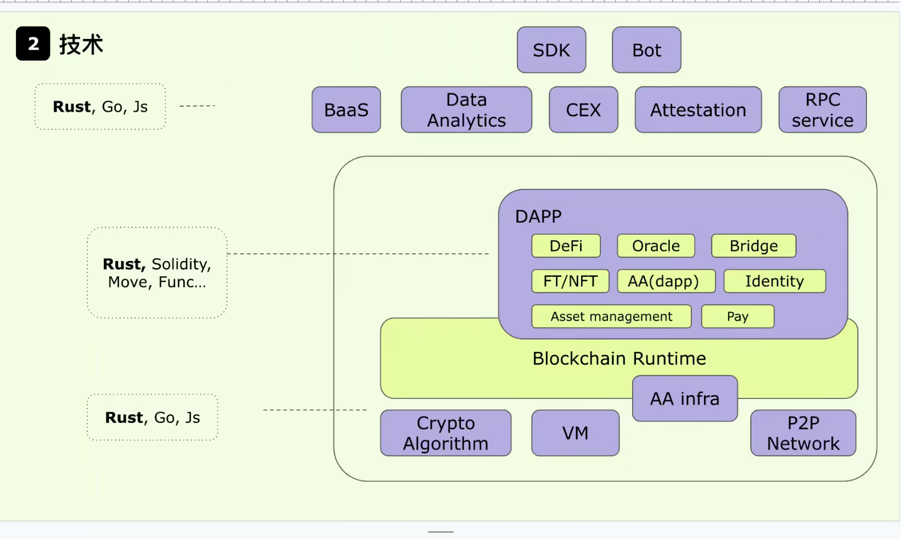
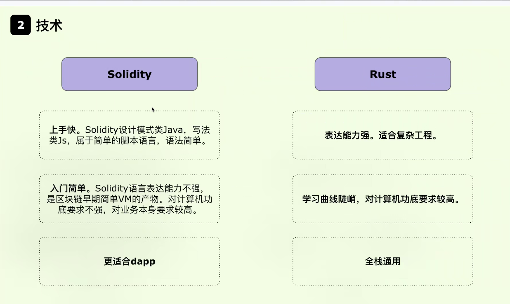
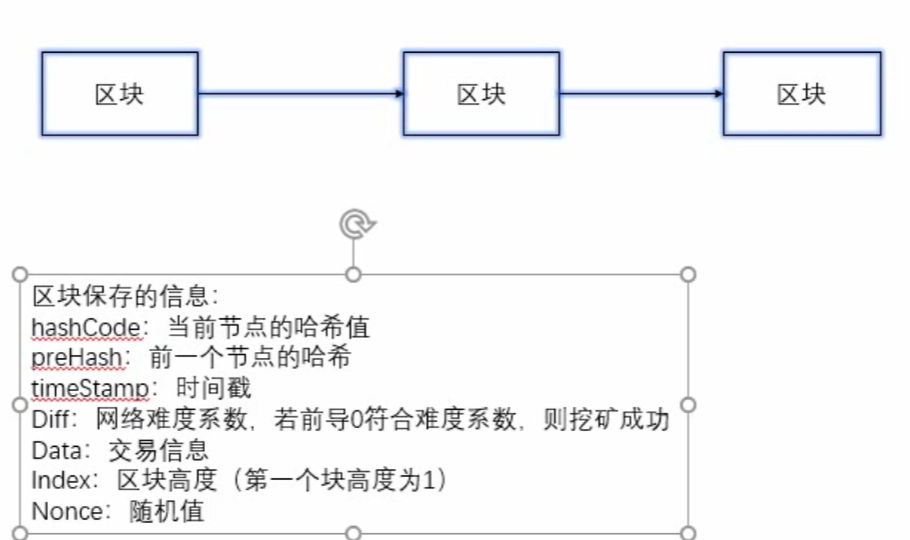

### 1.环境安装

**go build hello**

在src目录或hello目录下执行 go build hello，只在对应当前目录下生成文件。

**go install hello**

在src目录或hello目录下执行 go install hello，会把编译好的结果移动到 $GOPATH/bin。

**go run hello**

在src目录或hello目录下执行 go run hello，不生成任何文件只运行程序。

**go fmt hello**

在src目录或hello目录下执行 go run hello，格式化代码，将代码修改成标准格式。

- Go语言：https://golang.org/
- Go语言中文网：https://studygolang.com/
- Go语言包管理：https://gopm.io/

### 2.变量声明

string，int，bool ，float， const

## 输出方法

**fmt.Print**：输出到控制台（仅只是输出）

**fmt.Println**：输出到控制台并换行

**fmt.Printf**：仅输出格式化的字符串和字符串变量（整型和整型变量不可以）

**fmt.Sprintf**：格式化并返回一个字符串，不输出。

LevelDB
挖矿过程
PoW挖矿
将区块放到链中（链表）
数据持久化存储（levelDB）
在广域网中广播（UDP）