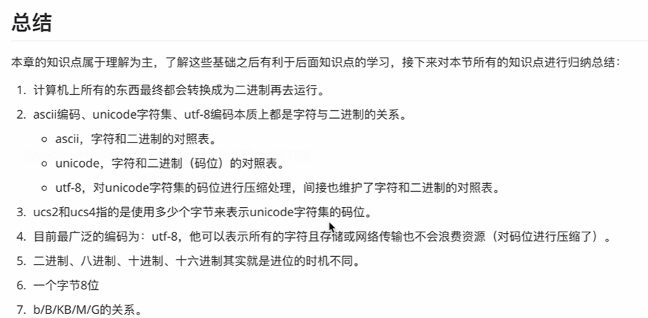

1.进制
计算机底层本质都是二级制
2.单位
位 b  10000010  8位
字节 byte  8位一个字节
千字节 KB ，1024字节=1024*8位
兆 M， 1024个千字节=1024*1024字节=1024*1024*8
千兆 G  1024个兆就是1千兆  即 1G= 1024*1024*1024*8
万亿字节 T   1024个G就是1T  即 1T=1024*1024*1024*1024*8
3.编码
ascii编码
    A-> 按照ascii码对照表找到他对应的二进制 01000001
unicode万国码
    ucs2,ucs4
utf-8
    对unicode进行压缩
