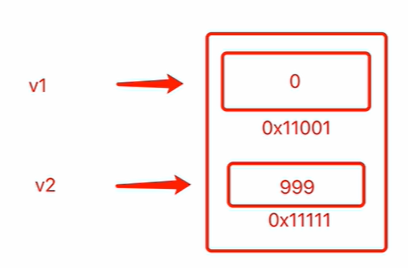

day05数据类型
整型：用于表示整数
    有符号整型
        int8：（-128~127）
        int16(-32768~32767)
        int32
        int64
        int：在32位操作系统上使用32位，在64位操作系统上使用64位
    无符号整型
        uint8 (0-255)
        uint16(0-65535)
        uint32
        uint64
        uint：在32位操作系统上使用32位，在64位操作系统上使用64位
    整型之间的转换
        
浮点型：用于表示小数
    float32,用32位（4个字节）来存储浮点型
    float64, 用64位（8个字节）来存储浮点型
布尔型：表示真/假
字符串：用于表示文本信息

数组：表示多个数据（数据集合） ["长沙","东莞","惠州"]

指针：表示内存地址的类型
切片：用于多个数据（数据集合）
字典：表示键值对的集合
结构体：自定义一些数据集合
接口：用于约束和泛指数据类型
decimal:
    go语言内部无decimal
    第三方包，则需要再本地的go环境中先安装，再使用，第三方包源码地址：https://
    go get github.com/shopspring/decimal

进制转换
go代码中：
    十进制，整型的方式存在
    其他进制，事宜字符串的形式存在
    
常见数学运输
math

指针/nil/声明变量/new
    声明变量
        var v1 int
        v2 := 999
    
    指针
        指向一块内存地址
        var v3 = *int   //默认存储nil
        v4 := new(int)  //默认存储0    
    
    new关键字用于创建内存并进行内部数据的初始化，并返回一个指针类型
    nil 指go语音中的空值
        var v100 *int
        var v101 *int8
超大整型
    import big
    
    

        

作业（21题）
1.Go语言中int占位多少字节   
    在32位上占4个字节，在64位上占8个字节
2.整型中有符号和无符号是什么意思？
    无符号整数类型：只能表示非负整数
    有符号整数类型：表示正数，负数，0
3. 整型可以表示最大的范围是多少？ 超出怎么办？
   超过范围不能正确的表示
4. 什么是nil
   
5. 十进制是以整型方式存在，其他进制则是以字符串的形式存在？如何实现进制之间的转换
6. 简述如下代码的意义
    var v1 int
    var v2 *int
    var v3 = new(int)
7. 浮点型为什么有时无法精确表示小数?
8. 如何使用第三方包decimal？
9. 简述ascii，unicode，utf-8的关系
10. 判断：Go语言中的字符串是utf-8编码的字节序列
11. 什么是rune?
12. 判断:字符串是否可变？
13. 列表你记得的字符串的常见功能
14. 字符串和字符集合，rune集合如何实现相互转换
15. 字符串如何实现高效的拼接？
16. 简述数组的存储原理
17. 根据要求写代码
   names := [3]string{"Alex","aa","bb"}
    a.请根据索引获取“bb”
    b.请根据索引获取“alex”
    c.请根据索引获取“aa”
    d.请将name数组的最后一个元素修改为“大烧饼"
18. 看代码输出结果
    var nestData [3][2]int
    fmt.Println(nestData)
19. 请声明一个有3个元素的数组，元素的类型是有两个元素的数组，并在数组中初始化值
    [
    ["alex","aaa"],
    ["eric","admin"],
    ["tony","ppp"],
]
20. 循环如下数组并使用字符串格式化输出如下内容：
    dataList := {
    ["alex","aaa"],
    ["eric","admin"],
    ["tony","ppp"],
}
    最终实现输出:
    我是Alex,我的密码是aaa.
    我是eric,我的密码是admin.
    我是tony,我的密码是ppp.
21. 补充代码实现用户登录
    dataList := {
    ["alex","aaa"],
    ["eric","admin"],
    ["tony","ppp"],
    }

    

 

