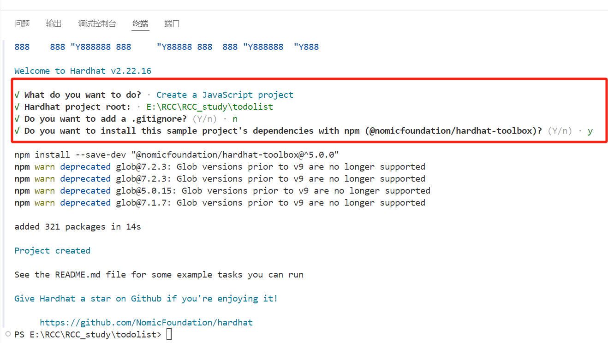

1、新建的文件夹todolist
2、npm init -y   创建空项目    --出现package.json
3、npm i -D hardhat  安装hardhat依赖    --出现package-lock.json,node-modules
4、npx hardhat init  --hardhat 初始化JavaScript项⽬
5、选择javascript project

6、在 ignition/modules 文件夹中创建 TodoList.js 文件。 在此7、文件中，粘贴以下代码以部署 TodoList 智能合约
    const { buildModule } = require("@nomicfoundation/hardhat-ignition/modules"); 
    module.exports = buildModule("TodoListModule", (m) => { 
    const todoList = m.contract("TodoList", []); 
    return { todoList }; 
    });

在主项目目录中，打开 hardhat.config.js。代码应如下所示
    require("@nomicfoundation/hardhat-toolbox"); 
    require("dotenv").config();   //需要添加
    /** @type import('hardhat/config').HardhatUserConfig */ 
    module.exports = { 
    solidity: "0.8.24", 
    networks: { 
    hardhat: {}, 
    }, 
    };
8、npx hardhat node  启动本地网络
9、打开新的终端界面部署 TodoList 到本地网络
    npx hardhat ignition deploy ./ignition/modules/TodoList.js --network localhost
10、npm install dotenv --save   为了在 hardhat 中使用环境变量我们安装 dotenv
11、npx hardhat ignition deploy ./ignition/modules/TodoList.js --network sepolia
12、在https://sepolia.etherscan.io/address/0x4fc21Da131Cb4d3732C9fbddF2A7D24d80C7b13e （拼上部署后的地址）

